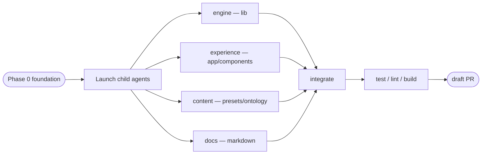

# PrepMind: make the platform multi-exam
Turn the RRB-NTPC-only app into a multi-exam platform. First run (no `exam_config`) shows an onboarding exam-picker; the chosen exam reconfigures subjects, sections, negative-marking, ontology, prompts, and branding. RRB NTPC remains reproducible as one preset. All Hard Rules (`CLAUDE.md §2`) are preserved — `ga`-specific grounding generalizes to a per-subject `generation_mode`, never weakens.
## Two decisions to confirm BEFORE coding
These gate the whole plan. My recommendation + the alternative for each; I'll wait for your OK or override before executing.
### Decision 1 — Subjects model (recommended: per-exam data in `exam_config`)
Today `math|reasoning|ga` is a Postgres `CHECK` (`migrations/0001_v1_init.sql:22`), a TS union (`lib/db/types.ts:3`), Zod enums (`app/concepts/actions.ts:9`, `app/mock/actions.ts:8`), and constants (`lib/services/mock.ts:10`, `components/graph/GraphCanvas.tsx:31`).
Recommendation: drop the DB `CHECK`; keep `concept.subject` as a free-text key; make the subject catalog per-exam data on `exam_config.subjects` JSONB = `[{key, label, generation_mode}]` where `generation_mode` is `grounded` or `verified_free`. Replace every `subject === 'ga'` with a `generation_mode` lookup; validate subject keys against the catalog at Zod boundaries. `sections` gain an explicit `subject_key`, deleting the keyword-sniffing `subjectForSection`.
Why JSONB over a `subject` table: single active exam (Decision 2) plus `CLAUDE.md §14` (no multi-tenancy) plus KISS. `exam_config` already stores `sections` JSONB; the catalog is tiny, read-mostly, and always loaded with config, so a table plus FK plus joins everywhere is unnecessary.
Alternative: a dedicated `subject` table with an FK from `concept.subject`. Stronger referential integrity, but more surface area and joins; pick this only if DB-enforced subject keys are worth the added complexity.
### Decision 2 — Data scoping on exam switch (recommended: one active exam per instance)
No table has `exam_id`; `exam_config` is a singleton (`lib/db/queries/examConfig.ts` delete-then-insert).
Recommendation: keep one active exam. First run seeds the chosen exam's subjects/sections/ontology/negative-marking. Switching later is a separate, explicit destructive reseed: export-first (Hard Rule §5 data ownership), typed confirmation, clear exam-scoped derived/study data, then seed the new exam. No `exam_id` columns.
Why: matches `CLAUDE.md §14` (single-user, no multi-tenancy) and is far smaller than the alternative. First-run is the common path; switching is rare.
Alternative: add `exam_id` FKs across roughly 10 tables so multiple exams coexist. Much larger, conflicts with §14, and is not recommended.
## Current state (what's coupled)
* Subject enum: `migrations/0001_v1_init.sql:22`, `lib/db/types.ts:3`, `app/concepts/actions.ts:9`, `app/mock/actions.ts:8`, `lib/services/mock.ts:10`, `components/graph/GraphCanvas.tsx:31`, `app/concepts/page.tsx (25-30)`.
* GA special-casing: `lib/services/cardGeneration.ts:38`, `lib/services/cardGeneration.ts:77`, `lib/services/generation.ts:63`, `lib/services/generation.ts:109`, `lib/services/generation.ts:289`, `lib/services/currentAffairs.ts:243`, `lib/db/queries/questions.ts:85`, `app/cards/page.tsx (18-19)`, `app/generate/page.tsx (10-11)`, `app/current-affairs/actions.ts:51`.
* Mock section-to-subject mapping: fragile keyword match `subjectForSection` in `lib/services/mock.ts (12-18)`.
* Hardcoded constants: `GUESS=0.25` in `lib/readiness.ts:10`; neg-ratio fallbacks in `lib/services/calibration.ts:14`, `lib/services/mock.ts:95`, `app/dashboard/page.tsx:36`, `app/calibration/page.tsx:26`; 4-option assumption in `lib/llm/questionChecks.ts:29`, `lib/llm/questionChecks.ts:33`, `lib/services/generation.ts (37-38)`, `lib/services/generation.ts (148-149)`, `app/mock/actions.ts:23`, `lib/llm/prompts/generate.ts (8-9)`; default target band in `app/dashboard/page.tsx:38`. `breakEvenP(negRatio)` in `lib/calibration.ts:77` is already general.
* Prompts hardcode `RRB NTPC`: `lib/llm/prompts/tutor.ts:25`, `lib/llm/prompts/tutor.ts:29`, `lib/llm/prompts/generate.ts:18`, `lib/llm/prompts/generate.ts:41`, `lib/llm/prompts/generate.ts:99`, `lib/llm/prompts/generate.ts:145`, `lib/llm/prompts/generate.ts:179`, `lib/llm/prompts/generate.ts:213`, `lib/llm/prompts/generate.ts:233`, `lib/llm/prompts/generate.ts:261`, `lib/llm/prompts/generate.ts:294`, `lib/llm/prompts/generate.ts:311`, `lib/llm/prompts/diagnose.ts:18`, `lib/llm/prompts/profile.ts:19`, `lib/llm/prompts/verify.ts:78`, `lib/llm/prompts/feynman.ts:6`.
* RRB content and integrations: `scripts/seed-ontology.ts`, `scripts/seed.ts`, `lib/caRanking.ts`, `lib/testbook/*`, `lib/services/testbookImport.ts:156`.
* Branding: `app/manifest.ts (6-7)`, `app/layout.tsx (7-10)`, `components/Sidebar.tsx:59`.
* Onboarding/config absence: `app/page.tsx` always redirects to `/review`; no first-run gate; `lib/services/mock.ts:33` throws while other code falls back to RRB defaults.
* Runner facts: migrations are numbered SQL via `scripts/migrate.ts`; next migration is `0011`; validation commands are `npm test`, `npm run lint`, `npm run build`; the constraint to drop is `concept_subject_check`.
## Phased plan (runnable end-to-end at every boundary)
### Phase 0 — Foundation: data model and shared contract (sequential; unblocks all)
* Add `migrations/0011_multi_exam.sql`: drop `concept_subject_check`; keep `idx_concept_subject`; add `exam_config.subjects JSONB`; add `exam_config.options_per_question INT NOT NULL DEFAULT 4`; backfill any existing row to the RRB preset, including `sections[*].subject_key` via today's keyword map.
* Update `lib/db/types.ts`: widen `Subject` to a string key alias; add `GenerationMode`, `ExamSubject`, `ExamSection` with `subject_key`; extend `ExamConfig` with `subjects` and `options_per_question`.
* Add `lib/exam/presets.ts`: `ExamPreset` type and `RRB_NTPC` preset with subjects, sections, negative-marking, option count, qualifying fraction, and CA category priors.
* Move the RRB ontology data out of `scripts/seed-ontology.ts` into `lib/exam/ontology/rrb-ntpc.ts`.
* Add `lib/exam/subjects.ts` with pure, unit-tested helpers: `generationModeFor`, `verifiedFreeSubjectKeys`, `groundedSubjectKeys`, `subjectLabel`, `guessProbability`.
* Add `lib/exam/guard.ts`: server helper `requireExamConfig()` redirects to `/onboarding` when config is absent.
* Update `lib/db/queries/examConfig.ts` to persist/read `subjects` and `options_per_question` while keeping singleton semantics.
Boundary check: the app still runs on a backfilled RRB instance; widening the union is backward-compatible with existing literals.
### Phase 1 — Onboarding gate, exam config, and switch flow
* Add `app/onboarding/page.tsx` and `app/onboarding/actions.ts`: exam-picker with RRB NTPC preset, built with warm ivory canvas, coral primary action, hairlines, and light mode only.
* Update `app/page.tsx`: redirect to `/onboarding` when unconfigured, otherwise `/review`; `/onboarding` redirects to `/review` when already configured.
* Update `components/exam/ExamConfigForm.tsx` and `app/exam/actions.ts`: edit subjects (`key`, `label`, `generation_mode`) and per-section `subject_key`; remove hardcoded RRB copy; validate sections against the catalog.
* Add explicit switch flow per Decision 2: export-first guidance, typed confirmation, clear exam-scoped derived/study data, seed the selected exam.
* Apply `requireExamConfig()` to config-dependent entry pages/actions.
### Phase 2 — Generalize GA to `generation_mode`
* Services: update `lib/services/cardGeneration.ts`, `lib/services/generation.ts`, and `lib/services/currentAffairs.ts` to use `generationModeFor(...)` instead of `subject === 'ga'` or `subject !== 'ga'`.
* Mocks: update `lib/services/mock.ts` to use section `subject_key`; delete `subjectForSection` and `SUBJECTS`.
* Questions query: make `getConceptsNeedingQuestions` accept verified-free subject keys from config, replacing `WHERE c.subject <> 'ga'`.
* UI/actions: update `app/cards/page.tsx`, `app/generate/page.tsx`, `app/current-affairs/actions.ts`, `app/concepts/page.tsx`, `app/concepts/actions.ts`, and `components/graph/GraphCanvas.tsx` to use subject catalog and generation modes.
### Phase 3 — Prompts: inject exam context
* Add an `ExamContext` prompt input containing exam name, subject labels, and per-mode generation guidance.
* Update `lib/llm/prompts/*` builders to accept context instead of hardcoding `RRB NTPC` and the RRB subject taxonomy.
* Update service call sites to load config and pass context into tutor, diagnosis, generation, verification, profile, and Feynman prompts.
* Keep grounding language keyed to `generation_mode: 'grounded'`, not the word `GA`.
### Phase 4 — Exam constants from config
* Update `lib/readiness.ts`: replace fixed `GUESS` with `guessProbability(options_per_question)` passed in by callers; update `lib/readiness.test.ts`.
* Remove `?? 1/3` fallbacks in `lib/services/calibration.ts`, `lib/services/mock.ts`, `app/dashboard/page.tsx`, and `app/calibration/page.tsx`; config is guaranteed by the gate.
* Generalize option count through `lib/llm/questionChecks.ts`, `lib/services/generation.ts`, `app/mock/actions.ts`, and `lib/llm/prompts/generate.ts`.
* Replace dashboard target fallback with the preset/config qualifying fraction.
### Phase 5 — Presets, ontology authoring, and external integrations
* Generalize `scripts/seed-ontology.ts` to seed any preset's ontology; use the extracted RRB ontology for the default CLI path.
* Add `lib/exam/ontologyGen.ts`: LLM-assisted ontology structure generator for arbitrary exams, with review-before-seed. This generates structure, not factual content, so Hard Rule §1 remains intact.
* Update `lib/caRanking.ts` to read per-exam category priors from the active preset/config, with neutral `0.5` default.
* Update `lib/services/testbookImport.ts` so full-vs-sectional classification derives from configured section totals, not the NTPC 100-question literal.
* Keep `scripts/seed.ts` as a generalized or clearly labeled RRB demo seed.
### Phase 6 — Branding from config
* Update `app/manifest.ts` and `app/layout.tsx` to derive the title from config (`PrepMind` plus active exam name) where available.
* Update `components/Sidebar.tsx` to receive the display name from server layout instead of hardcoding `RRB NTPC`.
### Phase 7 — Docs
* Update `CLAUDE.md`, `RRBNTPCbuildbrief.md`, `learnermemoryarchitecture.md`, `userstoriesplan.md`, and `README.md` to document multi-exam behavior, subject `generation_mode`, onboarding, and one-active-exam switch semantics.
* Preserve the Hard Rules unchanged except for the wording that generalizes GA/GK to any fact-grounded subject.
### Phase 8 — Validation
* Run `npm test`; update readiness/calibration tests and add tests for `lib/exam/subjects.ts` plus preset validation.
* Run `npm run lint` and `npm run build`.
* Manual validation: fresh DB → onboarding → RRB preset → review/practice/mock/generate work; second preset proves generalization; switching flow requires explicit confirmation.
## Invariants preserved
No ungrounded fact generation; every AI question clears the verify gate before display; no fine-tuning; append-only logs; selective retrieval; cost caps; design system on new screens.
## Orchestration
* **Decision**: Use child agents after Phase 0. The foundation must land first; after that, engine, UI, content, and docs are mostly file-disjoint and parallelize cleanly.
* **Dependencies and ordering**: Phase 0 is sequential and owned by the orchestrator. After it is stable, four children fan out in git worktrees. The orchestrator integrates, validates, commits, pushes, and opens one draft PR.
* **Launch config**: Use the plan-attached orchestration config as the source of truth. All children share one batch and local execution unless you change the config.
* **Child agents**:
    * **engine — lib generalization**: owns `lib/services/*`, `lib/db/queries/questions.ts`, `lib/llm/prompts/*`, `lib/readiness.ts`, `lib/caRanking.ts`, `lib/services/testbookImport.ts`, `lib/llm/questionChecks.ts`, and related tests. Local worktree `../pm-engine`, branch `oz/mx-engine`, output branch plus validation results.
    * **experience — onboarding and UI**: owns `app/**` and `components/**` for onboarding, exam form/switching, mode-based filters, subject selects, graph ordering, branding, and neg-ratio pages. Local worktree `../pm-experience`, branch `oz/mx-experience`, output branch plus validation results.
    * **content — presets and ontology**: owns `scripts/**`, `lib/exam/ontology/**`, and `lib/exam/ontologyGen.ts`. Local worktree `../pm-content`, branch `oz/mx-content`, output branch plus validation results.
    * **docs — documentation**: owns the five root docs. Local worktree `../pm-docs`, branch `oz/mx-docs`, output branch plus changed-doc summary.
* **Merge strategy**: Orchestrator merges engine, experience, content, and docs into one integration branch; resolves contract seams; runs full validation; commits with `Co-Authored-By: Oz <oz-agent@warp.dev>`; pushes and opens one draft PR.
* **Diagram**:

